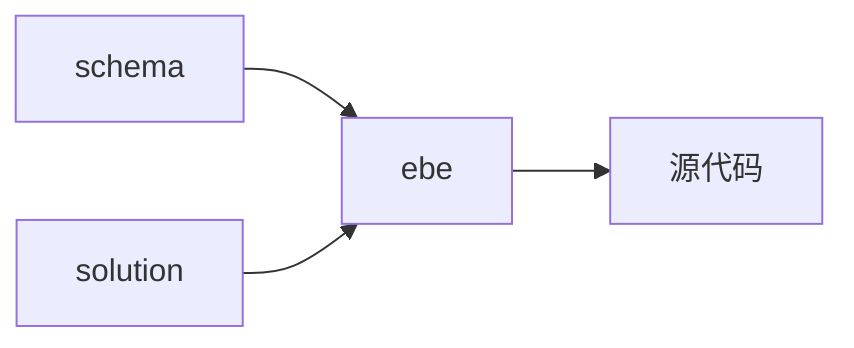
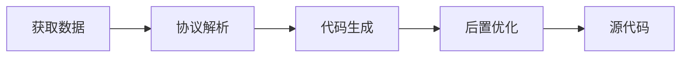
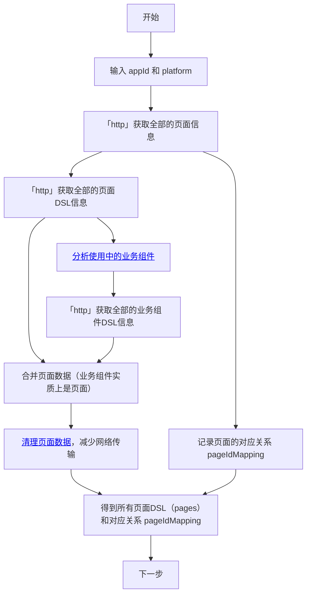
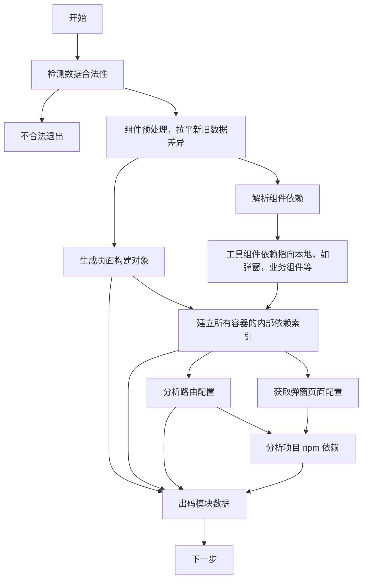
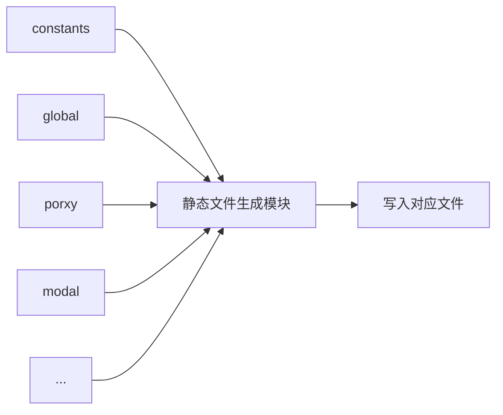
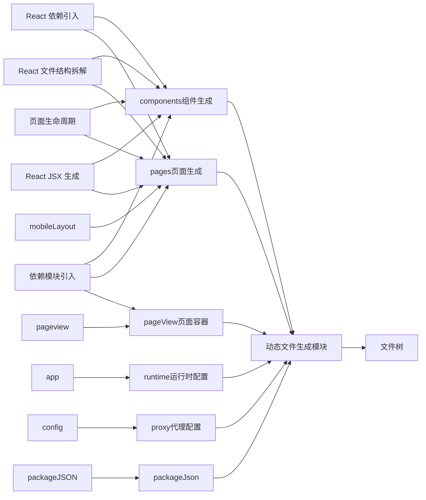
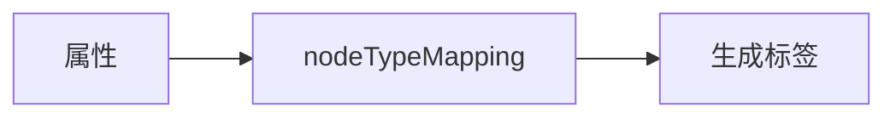
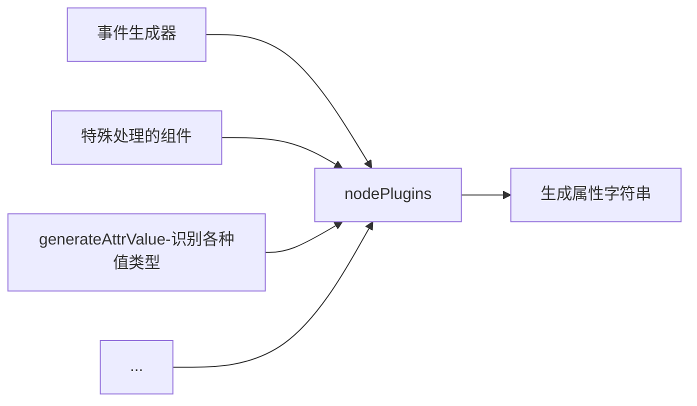

# ebe 端构建到端方案

## 出码模块的基本原理

出码模块的核心任务是将低代码编排出的页面 DSL（Domain Specific Language，领域特定语言）通过解析和拆解，转换成最终可执行的代码。



这个过程的输入和输出是非常直观的：输入是符合特定规范的搭建协议（schema），以及具体的项目框架（solution）；输出则是生成的源代码，通常以目录树的形式进行描述。

出码模块的流程和编译器的流程类似，都是将代码的一种表现形式转换成另一种表现形式。其工作流程大致分为如下几个步骤：获取数据、协议解析、代码生成、后置优化。



## 出码流程详解

### 获取页面数据

通过网络请求使用平台接口获取到所有需要的数据



#### 分析使用中的业务组件

业务组件的每一次被使用都是一个新的实例，但是实际上可能用到的是同一个业务组件，在页面的 DSL 中只保存了业务组件的实例 id ，因此需要整理后获取到真实在使用的业务组件配置数据（DSL）

#### 清理页面数据

某一些数据在源码生成时没有用处的，可以在此时进行首次清理

### 协议解析

协议解析的主要任务是将输入的 schema 解析成更适合出码模块内部使用的数据结构。也是进一步对数据的清理和修改。在这个环节处理低代码平台的 DSL 前置处理。方便在后续的出码流程中使用。



### 代码生成

代码生成的过程需要将代码进行抽象化。出码模块在代码生成过程中将复杂的项目产出问题，拆分为一个个相对专注且单一的代码块产出问题，同时也支持组合复用。

代码生成部分主要分为两大模块，静态文件生成和动态文件生成。

#### 静态文件生成

通用文件和简单的配置文件修改等都归位静态文件生成，使用统一的静态文件生成模块，执行所有的静态文件生成器。如：

```ts
export default function getFile(
  config?: LXProjectOptions,
): [string[], ResultFile] {
  // config 上一环节生成的项目配置
  const file = createResultFile('文件名，如 index', '.tsx|.ts', `文件内容`);

  return [['文件写入路径', 'src', 'xxx'], file];
}
```



#### 动态文件生成

动态文件生成就是根据用户的配置生成页面、组件和工具类代码的环节，是整个出码模块的核心功能。采用插件化设计，将文件生成的各个环节进行拆解和抽象，使得通过插件可以在任意的代码模块中插入任意的代码块。



##### React 文件结构拆解

React 文件结构拆解指的是将 React 的组件文件按照生命周期和文件结构拆解成独立的插槽，供插件化使用。插件可以单独在插槽之间插入代码，也可以在插槽之间再开插槽。

```tsx
const Page = () => {
  // Start
  // ConstructorStart
  // ConstructorEnd
  useEffect(() => {
    // DidMountStart
  }, []); // DidMountEnd

  useEffect(() => {
    // DidUpdateStart
  }); // DidUpdateEnd
  return (
    // RenderStart
    <div></div>
  ); // RenderEnd
}; //End

export default Page; // FileExport
```

##### 页面生命周期

页面生命周期函数严格来说不算一个出码模块的插件，而是出码模块 【React 文件结构拆解】插件的子插件。整个插件系统的特点就是先按照插件引入顺序执行的，在所有插件执行完成之后得到项目的文件树，又进行一次整理和排序最终生成文件数据，可以保证插件在同等效力的情况下，引入顺序不会对最终结果产生错误影响。比如都是生成文件结构，`[A2,A1,A3]` 和 `[A3,A2,A1]` 的引入顺序，最终都会被生成 `[A1,A2,A3]`。

比如：页面生命周期 -- 【组件状态变化后】

```tsx
const name = 'DidUpdateContent';
const linkAfter = 'DidUpdateStart';
const content = 'console.log("stateChange")';
```

表示增加一个插槽名称为 DidUpdateContent ，linkAfter 定义了它将被插到 DidUpdateStart 之后，它的内容为 content，最终生成的代码就是

```tsx
useEffect(() => {
  // DidUpdateStart
  console.log('stateChange');
}); // DidUpdateEnd
```

<!-- return [...basicParts, ...attrParts, ...childrenParts]; -->

##### React JSX 生成

React JSX 生成其实就是将组件 DSL 翻译成组件代码的过程。主要分成三部分，标签生成，属性生成，子组件生成。

```json
{
  "type": "Button",
  "props": {
    "type": "primary",
    "size": "large",
    "children": "$title$"
  },
  "style": {
    "textAlign": "center"
  },
  "setEvents": [
    {
      "dataName": "event",
      "path": [],
      "value": "onClick",
      "children": [
        {
          "dataName": "action",
          "actionObjId": "closeModal",
          "value": "closeModal"
        }
      ]
    }
  ],
  "components": []
}
```

###### 标签生成

标签生成比较简单，读取 DSL 配置，将 schema.type 翻译成 `<schema.type></schema.type>` 即可，如 `<Button></Button>`。



有些组件类型实际上是不存在的，如 Page 实际标签是 div ，因此需要 nodeTypeMapping 做一个转化。

```ts
nodeTypeMapping: {
  Page: 'div',
  MobileModal: 'div',
  BusiComp: 'div',
  MobilePopover: 'div',
},
```

###### 属性生成

属性生成，主要是处理 props，style，setEvents。主要就是针对这些属性的值进行操作，但是需要注意的是每个环节的处理方式都有所不同。



大部分的组件都可以走统一流程，有部分需要特殊处理的组件，将他们的处理逻辑放到统一组件中方便后期维护和管理，比如循环容器和列表组件，没有子组件层级，他们的子级从属性 `getEngineApis` 中处理，因此需要将子组件删除，并而外添加 `getEngineApis`。

```tsx
// 循环容器 和 动态待办
if (
  nodeTags === 'Loop' ||
  nodeTags === 'DynamicList' ||
  nodeTags === 'LoadMore' ||
  nodeTags === 'BlockSelect' ||
  nodeTags === 'DformList'
) {
  // Loop 不需要孩子
  pieces = pieces.filter((i) => i.type !== 'NodeCodePieceChildren');
  let LoopchildrenStr = '';
  if (nodeItem.components && config?.self) {
    LoopchildrenStr = config.self(nodeItem.components, scope);
  }
  pieces.push({
    type: PIECE_TYPE.ATTR,
    value: `getEngineApis={() => {
        return {
          ...injectData.getEngineApis(),
          MemoRenderer: {
            renderer: null,
            MemoLoopItem: (props: any) => {
              const item = props[props.itemKey] ?? props?.item;
              const i = props[props.indexKey] ?? props?.i;
              return (<>${LoopchildrenStr}</>)
            },
          },
        };
      }}`,
  });
}
```

###### 子组件生成

子组件的生成其实就是一个递归调用组件生成的过程，识别到特定组件时做同样的特殊处理即可。`config.self(nodeItem.components, scope);`

全部环节生成完毕后，按照 标签、属性、子集的特定顺序将字符串拼接到一起。与其他插件相同的是，JSX 生成也是一个插件，可以用下面的伪代码表达。

```tsx
const name = 'RenderJSX';
const linkAfter = 'RenderStart';
const content = `<${tagName}${attrsParts}>${childrenParts}</${tagName}>`;
```

最终生成代码为

```tsx
return (
  // RenderStart
  <Button
    type="primary"
    size="large"
    children={title}
    style={{ textAlign: 'center' }}
    onClick={(e: any) => {}}
  />
); // RenderEnd
```

### 后置优化

后置优化分为文件级别和项目级别两种：文件级别的后置优化在生成完一个文件后进行处理；项目级别的后置优化在所有文件都生成完了之后进行处理。

当前的后置优化内置了 prettier 对生成的字符串进行格式化处理

## 参考文档

[出码模块设计](https://lowcode-engine.cn/site/docs/guide/design/generator)

[使用出码功能](https://lowcode-engine.cn/site/docs/guide/expand/runtime/codeGeneration)
