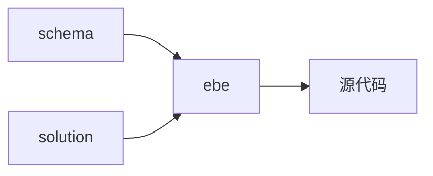
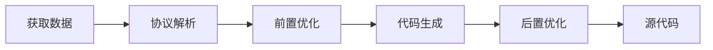
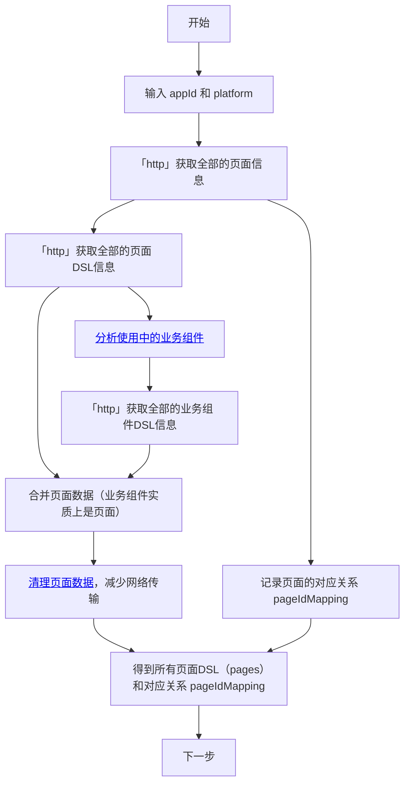

# ebe 端构建到端方案

## 出码模块的基本原理

出码模块的核心任务是将低代码编排出的页面 DSL（Domain Specific Language，领域特定语言）通过解析和拆解，转换成最终可执行的代码。

这个过程的输入和输出是非常直观的：输入是符合特定规范的搭建协议（schema），以及具体的项目框架（solution）；输出则是生成的源代码，通常以目录树的形式进行描述。

出码模块的流程和编译器的流程类似，都是将代码的一种表现形式转换成另一种表现形式。其工作流程大致分为如下几个步骤：获取数据、协议解析、前置优化、代码生成、后置优化。

## 出码流程详解

### 获取页面数据

通过网络请求使用平台接口获取到所有需要的数据

#### 分析使用中的业务组件

业务组件的每一次被使用都是一个新的实例，但是实际上可能用到的是同一个业务组件，在页面的 DSL 中只保存了业务组件的实例 id ，因此需要整理后获取到真实在使用的业务组件配置数据（DSL）

#### 清理页面数据

某一些数据在源码生成时没有用处的，可以在此时进行首次清理

### 协议解析

协议解析的主要任务是将输入的 schema 解析成更适合出码模块内部使用的数据结构。这样在后面的代码生成过程中就可以直接用这些数据，不必重复解析。

## 参考文档

[出码模块设计](https://lowcode-engine.cn/site/docs/guide/design/generator)

[使用出码功能](https://lowcode-engine.cn/site/docs/guide/expand/runtime/codeGeneration)
